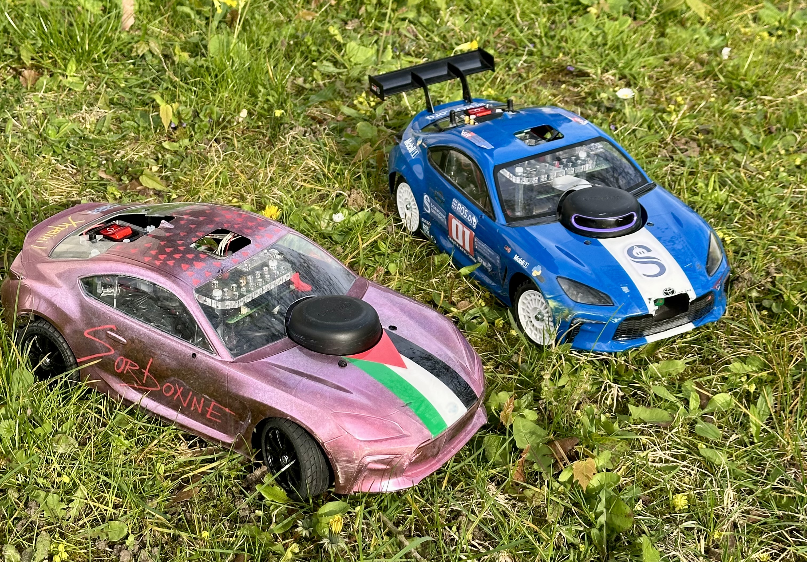

# Team NitROS

This repository contains the software stack developed by **Team NitROS (Sorbonne University)** for the ENS organized **CoVAPSy** (*Course Voiture Autonome Paris Saclay*) race.

All guides are available on this [website](https://jacobamaury.github.io/site_doc_CoVAPSy_SU/).

## Project Overview

The project aims to develop a fully autonomous vehicle based on **ROS 2** and the **Nav2 stack**, capable of navigating a race track with speed and reliability. It integrates localization, path planning, and control to achieve smooth and efficient trajectory tracking in a constrained environment.

## ENS Race Overview
https://ajuton-ens.github.io/CourseVoituresAutonomesSaclay/

## Références

Dynamic Window Pure Pursuit

- F. Ohnishi, M. Takahashi, [DWPP: Dynamic Window Pure Pursuit Considering Velocity and Acceleration Constraints](https://arxiv.org/abs/2601.15006). arXiv:2601.15006., 2026.

Smac Planner (Hybrid A*):

- S. Macenski, M. Booker, J. Wallace, [Open-Source, Cost-Aware Kinematically Feasible Planning for Mobile and Surface Robotics](https://arxiv.org/abs/2401.13078).
